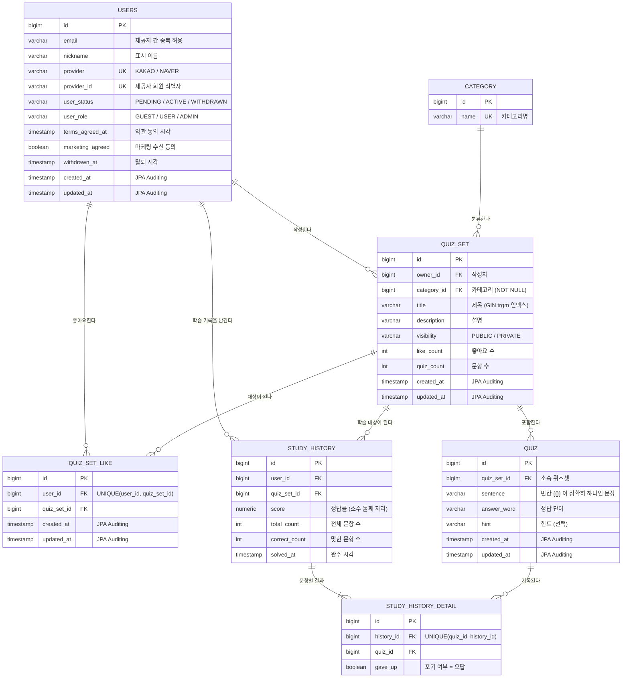
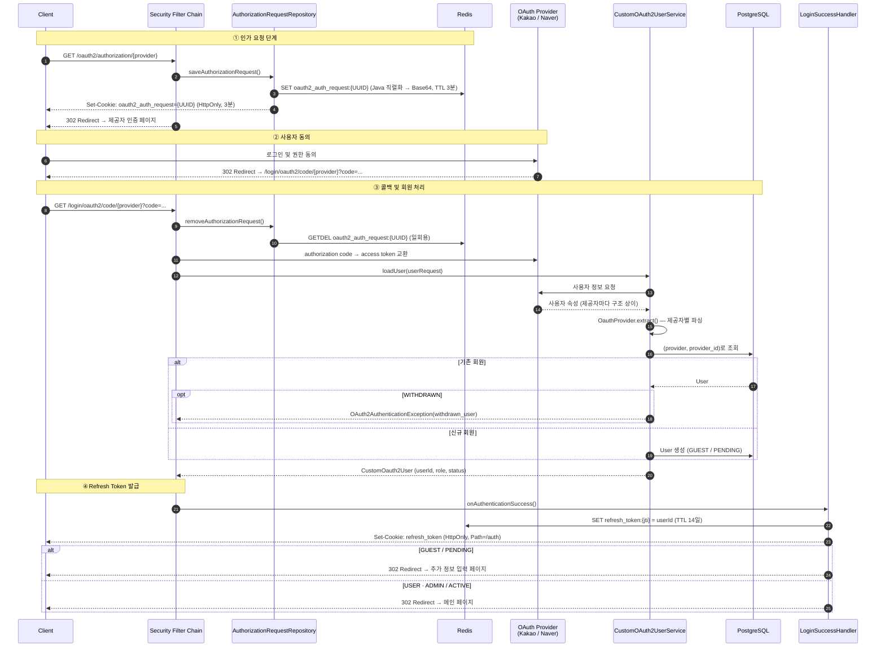
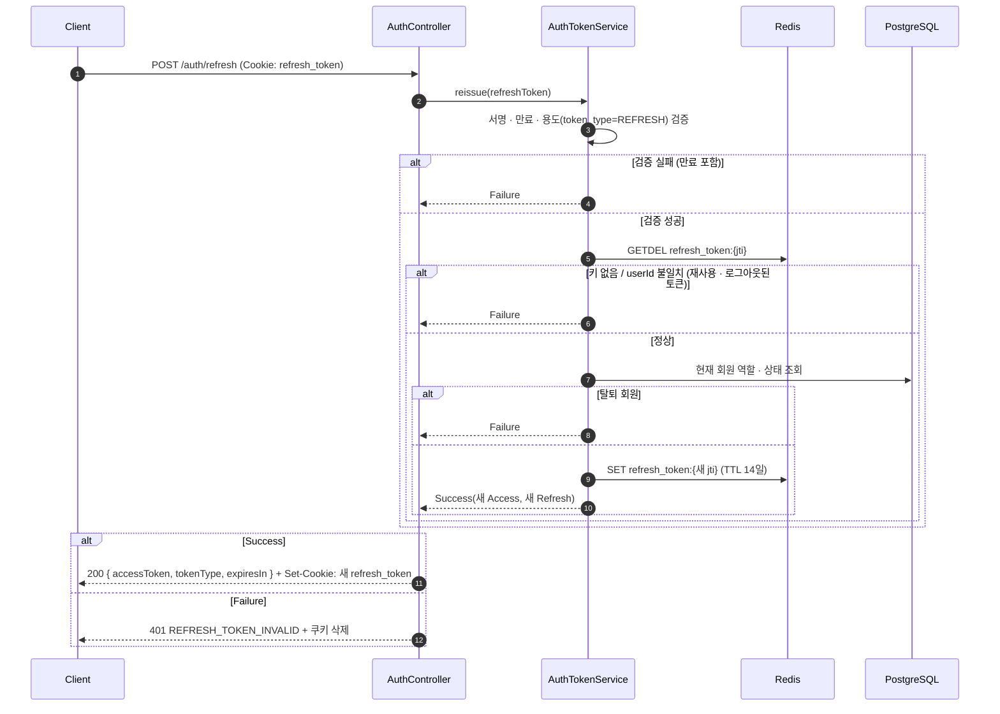
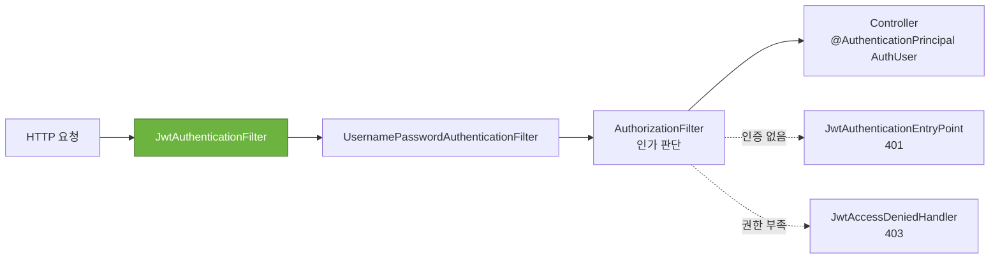
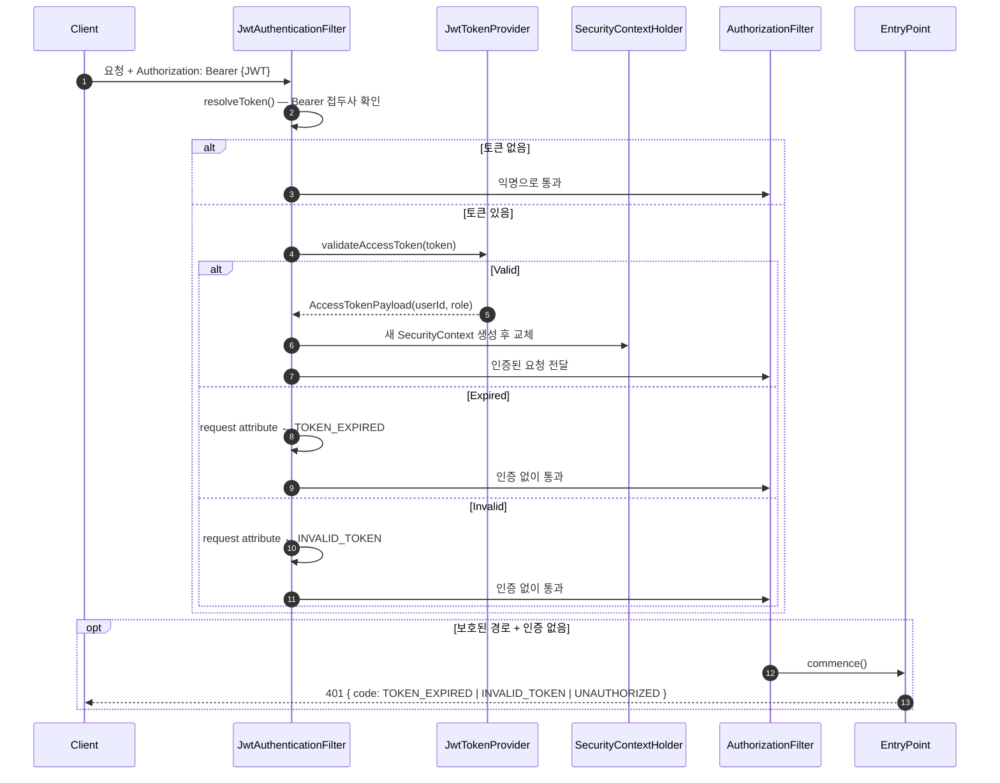

<div align="center">

# BlankEn

**직접 만든 영어 문장으로 빈칸 채우기 퀴즈를 만들고 공유하는 학습 플랫폼 — 백엔드 API 서버**

<br/>


</div>

---

## 프로젝트 소개

BlankEn은 사용자가 **직접 만든 영어 문장**으로 빈칸 채우기 퀴즈셋을 만들어 공유하고, 다른 사용자가 이를 풀며 학습하는 서비스입니다.
"제출" 버튼 없이 입력값이 정답과 일치하는 순간 바로 정답 처리되는 UX를 목표로 하며, 이후 **팔로우 소셜** 기능 및 다른 유저와의 **실시간 선착순 대결**까지 확장할 예정입니다.

이 저장소는 그 중 **백엔드 API 서버**입니다. 프론트 스택은 정해지지 않아 확장성 있게 설계하였습니다.

| 영역 | 구현 내용 |
| --- | --- |
| **인증 / 인가** | 카카오 · 네이버 OAuth 2.0 소셜 로그인, JWT Access Token + Redis 기반 Refresh Token(Rotation) |
| **회원** | 소셜 계정 기반 가입(GUEST → 추가 정보 입력 → USER), 닉네임 변경, 탈퇴(소프트 삭제) |
| **퀴즈셋** | 퀴즈셋 생성 · 수정(카테고리 · 공개 범위), 2단계 생성 플로우(셋 생성 → 퀴즈 추가) |
| **퀴즈** | 빈칸 문장(`{{}}`) 형식 검증, 추가 · 수정, 다른 퀴즈셋으로 일괄 이동, 퀴즈셋별 조회 |
| **검색** | 제목 키워드 + 카테고리 동적 조건 검색, 최신순 / 인기순 정렬, `pg_trgm` GIN 인덱스 |
| **좋아요** | 좋아요 · 취소(멱등), 좋아요한 퀴즈셋 목록, 동시 요청에서도 정확한 카운트 |
| **학습 기록** | 완주 시 점수 · 포기한 문제를 append-only로 기록 (`study_history` + `study_history_detail`) |

### 설계에서 중점을 둔 부분

- **클라이언트 종류와 무관한 인증** — 네이티브 앱에서는 서버 세션 쿠키와 리다이렉트 흐름이 성립하지 않습니다. 인증 결과는 JWT로 발급하고, OAuth2 인가 요청의 중간 상태만 **Redis**에 짧게(3분) 보관해 서버 세션 의존성을 제거했습니다.
- **채점은 클라이언트, 서버는 결과를 받는 쪽** — 즉시 정답 판정 UX를 위해 정답을 클라이언트에 프리페치하고, 서버는 완주 결과만 기록합니다. 조작 가능성이 있는 실시간 대결과 좋아요 · 랭킹처럼 신뢰가 필요한 값만 서버쪽 책임으로 둡니다.
- **동시성은 애플리케이션 검사가 아니라 원자적 연산으로** — 좋아요 중복은 `UNIQUE(user_id, quiz_set_id)` 제약이, 카운트는 `SET like_count = like_count + 1` 단일 UPDATE가 보장합니다. check-then-act 선검사는 메시지 품질용일 뿐 보장 수단으로 쓰지 않습니다.
- **쿼리 빌더 선택의 근거** — Kotlin JDSL은 Spring Data JPA 내부 패키지에 클래스를 끼워 넣는 구조라 부트 4.1에서 `ClassNotFoundException`으로 동작하지 않았습니다. **공개 API(`EntityManager`)만 쓰는 QueryDSL**을 채택해 프레임워크 버전 업에 영향받지 않도록 했습니다.
- **에러 응답 단일화** — 모든 실패는 `ErrorResponse(code, message, fieldErrors?)` 하나의 형식으로 내보냅니다. 상태 · 코드 · 메시지의 단일 출처는 `ErrorCode` enum이며, 진단용 내부 식별자는 로그에만 남기고 응답으로 내보내지 않습니다.

### 기술 스택

```
Kotlin 2.3.21 · Java 21 · Spring Boot 4.1.0 (WebMVC)
Spring Security · Spring Security OAuth2 Client · jjwt 0.12.6
Spring Data JPA / Hibernate · QueryDSL 5.1.0 (jakarta) · PostgreSQL (pg_trgm)
Spring Data Redis · springdoc-openapi 3.1.0
JUnit5 · MockK 1.14.11 · springmockk 5.0.1 · Testcontainers (PostgreSQL)
```


<br/>

## 테이블 ERD



**설계 노트**

- **회원은 `(provider, provider_id)`로 식별**합니다. 소셜 로그인만 허용하므로 비밀번호 컬럼이 없고, 같은 이메일이라도 제공자가 다르면 별개 계정으로 허용합니다. (단 이미 다른 소셜 계정이 존재한다고 사용자에게 고지 합니다.)
- **오답 = 포기한 문제뿐**입니다. 오답 입력 시 무제한 재입력을 허용하고, 재시도 끝에 맞힌 문제는 정답으로 취급합니다. 따라서 문항별 결과는 `gave_up` 한 컬럼으로 충분합니다.
- **`study_history`는 append-only**입니다. 최근 1건을 덮어쓰지 않고 완주할 때마다 누적합니다 — 성장 추이 · 오답 변화 추적이 학습 앱의 핵심 가치이고, 불변 이벤트 누적은 갱신 충돌이 없습니다.
- **진행 상태(이어풀기) 테이블은 없습니다.** 어디까지 풀었는지는 Redis Hash(TTL 24h)에만 두고, 완주했을 때만 RDB로 flush합니다. TTL이 곧 "하루 이내에만 이어풀기" 정책이 되어 별도 만료 정리 로직이 필요 없습니다. *(구현 예정)*

<br/>

## 인증 흐름

### 1. OAuth 2.0 소셜 로그인

인가 요청 상태를 **서버 세션 대신 Redis**에 보관하고(쿠키에는 랜덤 키만), 로그인 성공 시에는 **Refresh Token만 HttpOnly 쿠키로** 발급한 뒤 프론트엔드로 리다이렉트합니다.



**핵심 포인트**

| 항목 | 선택 | 이유 |
| --- | --- | --- |
| 인가 요청 저장소 | Redis + 쿠키에는 UUID 키만 | 서버 세션 의존 제거, 직렬화된 요청 본문을 클라이언트에 노출하지 않음 |
| 인가 요청 꺼내기 | `GETDEL` | 같은 콜백이 두 번 와도 한 번만 성공 |
| 쿠키 키 검증 | UUID 형식만 인정 | 조작된 쿠키 값으로 임의의 Redis 키를 조회하지 못하게 함 |
| 성공 시 발급 토큰 | Refresh Token만 (쿠키) | 리다이렉트 응답으로는 Access Token을 안전하게 넘길 수 없음 — 쿼리 파라미터는 브라우저 히스토리 · 서버 로그에 남는다 |
| 제공자별 응답 차이 | `OauthProvider` enum 추상 메서드 | 제공자가 늘어나도 enum 상수 하나만 추가하면 됨 |
| 실패 처리 | 에러 코드만 쿼리 파라미터로 리다이렉트 | 내부 메시지 대신 `access_denied` / `withdrawn_user` 등 정해진 코드만 노출 |

<br/>

### 2. Access Token 발급 · 재발급 (Refresh Token Rotation)

프론트는 리다이렉트된 페이지에서 바로 `POST /auth/refresh`를 호출해 첫 Access Token을 받습니다. 이후 Access Token이 만료(`TOKEN_EXPIRED`)될 때도 같은 API로 재발급합니다.



**설계 의도**

- **한 번 쓴 Refresh Token은 무효 (Rotation)** — `GETDEL`로 꺼내면서 지우므로, 같은 토큰으로 동시에 재발급을 요청해도 한 요청만 성공합니다. 탈취된 토큰이 재사용되면 정상 사용자의 다음 재발급이 실패해 이상을 드러냅니다.
- **역할은 토큰이 아니라 DB에서** — 재발급 시점에 DB의 현재 역할 · 상태로 Access Token을 만들기 때문에, 가입 완료(GUEST → USER)와 탈퇴가 별도 처리 없이 다음 재발급에 반영됩니다.
- **토큰마다 Redis 키 분리** — `refresh_token:{jti}` 단위로 저장해 한 회원이 여러 기기에 동시에 로그인할 수 있고, 로그아웃은 해당 기기의 토큰만 폐기합니다.
- **Refresh 쿠키는 `Path=/auth`** — `/auth/refresh`, `/auth/logout` 요청에만 실리고 일반 API 요청에는 전송되지 않습니다.
- **용도 클레임(`token_type`)으로 토큰 혼용 차단** — 만료된 토큰도 용도를 확인해, Refresh Token을 Access 자리에 넣어 `Expired`를 유도하는 경로를 막습니다.

<br/>

### 3. JWT 요청 인증

이후 모든 요청은 `Authorization: Bearer {accessToken}` 헤더로 인증합니다.





**설계 의도**

- **DB 조회 없는 인증** — `UserDetailsService` 없이 토큰 클레임(`sub`, `role`)만으로 `Authentication`을 조립해 요청마다의 회원 조회 쿼리를 없앴습니다. 역할 변경은 다음 재발급(최대 30분) 때 반영됩니다.
- **필터는 예외를 던지지 않고 원인만 기록** — 접근 차단은 인가 단계에 맡기고, 실패 원인은 request attribute로 EntryPoint에 넘깁니다. 공개 경로는 토큰 상태와 무관하게 동작합니다.
- **실패 사유별 응답 코드** — 프론트는 `TOKEN_EXPIRED`면 재발급 후 재시도, `INVALID_TOKEN` / `UNAUTHORIZED`면 재로그인으로 분기합니다.
- **결과를 sealed interface로** — 검증 결과를 `TokenResult.Valid / Expired / Invalid`로 반환해 호출부가 `when`으로 모든 경우를 빠짐없이 처리하도록 컴파일러가 강제합니다.
- **필터를 빈으로 등록하지 않음** — `Filter` 타입 빈은 부트가 서블릿 필터로 자동 등록해 두 번 실행되므로, `SecurityConfig`에서 직접 생성해 Security 필터 체인에만 넣었습니다.

<br/>

## 동시성 제어

> Redis 싱글스레드는 "명령 하나의 원자성"만 보장합니다. 여러 명령에 걸친 논리적 원자성은 UNIQUE 제약 · `SETNX` · Lua 스크립트로 별도 설계합니다.

| 지점 | 문제 | 해법 | 상태 |
| --- | --- | --- | --- |
| 좋아요 중복 | check-then-act 경쟁 | `UNIQUE(user_id, quiz_set_id)` + `saveAndFlush`로 즉시 INSERT 후 위반을 도메인 예외로 변환 | ✅ |
| 좋아요 카운트 | 갱신 유실 (Lost Update) | 더티 체킹 대신 `like_count = like_count + 1` 단일 UPDATE, 취소 시 `like_count > 0` 조건 | ✅ 동시성 테스트 |
| Refresh Token 재사용 | 동시 재발급 | Redis `GETDEL` — 한 요청만 성공 | ✅ |
| 좋아요 카운트 (고도화) | DB 쓰기 부하 | Redis 원자 `INCR` + 멱등 배치 flush | 예정 |
| 대결 선착순 | 최초 정답자 1인 확정 | `SETNX winner:{roomId}:{questionId}` — first-writer-wins | 예정 |
| 대결 방 정원 | 정원 초과 동시 입장 | Redis Lua 원자 check-and-increment | 예정 |

<br/>

## 검색

- 제목 키워드 · 카테고리 · 정렬을 **QueryDSL 동적 조건자**로 조합합니다. `null`인 조건은 `where`에서 자동으로 빠집니다.
- 제목 부분 검색은 `lower(title) like ...`가 아니라 **`ilike`** 로 렌더링합니다. 함수를 씌우면 `pg_trgm` GIN 인덱스(`idx_quiz_set_title_trgm`)를 타지 못하기 때문입니다. `ilike`는 JPQL 표준이 아니라 `Expressions.booleanTemplate`으로 직접 렌더링하고, 그 대신 `%` · `_` 이스케이프를 직접 처리합니다.
- 정렬은 `최신순` / `인기순`이며, 동률일 때 페이지 경계가 흔들리지 않도록 `id desc`를 보조 정렬로 붙입니다.
- 필터 변경 시 클라이언트가 보유한 결과를 거르지 않고 **서버에 재요청**합니다 — 페이지네이션 위에서의 클라이언트 필터링은 로드된 부분집합만 거르기 때문입니다.

<br/>

## API 규약

| 항목 | 규칙 |
| --- | --- |
| 응답 상태 | 생성 `201` + `Location`, 본문 없는 성공 `204`, 조회 · 수정 `200` |
| 에러 응답 | `ErrorResponse(code, message, fieldErrors?)` 하나로 통일 |
| 에러 코드 | `도메인 알파벳 + 3자리 순번` — `C` Common · `U` User · `Q` Quiz · `G` Category · `A` Auth, `999`는 서버 오류로 예약 |
| 역직렬화 실패 | 깨진 JSON · 필수 필드 누락도 `C001`로 통일 (스프링 기본 에러 바디 노출 방지) |
| 페이징 | `PageResponse<T>`로 감쌈 — `PageImpl` 직렬화 구조에 클라이언트를 묶지 않음 |
| 메서드 | 멱등하지 않은 변경은 `POST`, 부분 수정은 `PATCH` |

API 문서는 서버 실행 후 `http://localhost:8080/blanken/swagger-ui.html`에서 확인할 수 있습니다.

<br/>

## 실행 방법

### 사전 준비

- JDK 21
- PostgreSQL (`pg_trgm` 확장 사용)
- Redis
- Docker

### 환경 변수

프로젝트 루트에 `application-secret.yaml`을 두거나 OS 환경변수로 설정합니다. 

| 변수 | 설명 | 기본값 |
| --- | --- | --- |
| `DB_URL` | PostgreSQL JDBC URL | `jdbc:postgresql://localhost:5432/blanken` |
| `DB_USERNAME` / `DB_PASSWORD` | DB 계정 | `user` / (빈 값) |
| `JWT_SECRET` | Base64 인코딩된 32바이트 이상 서명 키 | — |
| `KAKAO_CLIENT_ID` / `KAKAO_CLIENT_SECRET` | 카카오 OAuth 클라이언트 | — |
| `NAVER_CLIENT_ID` / `NAVER_CLIENT_SECRET` | 네이버 OAuth 클라이언트 | — |

### 빌드 · 실행

```bash
./gradlew bootRun
```

검색 인덱스와 개발용 시드 데이터는 수동으로 적용합니다.

```bash
psql -U user -d blanken -f src/main/resources/schema.sql   # pg_trgm 확장 + GIN 인덱스
psql -U user -d blanken -f src/main/resources/data.sql     # 카테고리 · 유저 · 퀴즈셋 시드
```

### 테스트

```bash
./gradlew test
```

Repository 테스트와 동시성 테스트는 **Testcontainers로 실제 PostgreSQL**을 띄워 실행하므로 Docker가 필요합니다. (`ilike`, `pg_trgm`처럼 PostgreSQL 전용 문법을 H2로는 검증할 수 없기 때문입니다.)

<br/>

[//]: # (## 로드맵)

[//]: # ()
[//]: # (| 마일스톤 | 내용 | 상태 |)

[//]: # (| --- | --- | --- |)

[//]: # (| **M1 — 기반** | 소셜 로그인 · JWT, 퀴즈셋 / 퀴즈 CRUD, 학습 기록 | 진행 중 |)

[//]: # (| **M2 — 소셜** | 좋아요&#40;Redis 카운터&#41;, 검색 고도화, 팔로우, 알림&#40;MQ + 별도 알림 서비스 + FCM&#41; | 일부 진행 |)

[//]: # (| **M3 — 실시간 대결** | WebSocket, 선착순 판정&#40;`SETNX`&#41;, 방 정원&#40;Lua&#41;, 스코어보드 | 예정 |)

[//]: # (| **M4 — 고도화 · 운영** | 이어풀기&#40;Redis TTL&#41;, Elasticsearch + Nori, Docker, Kubernetes, AWS | 예정 |)
